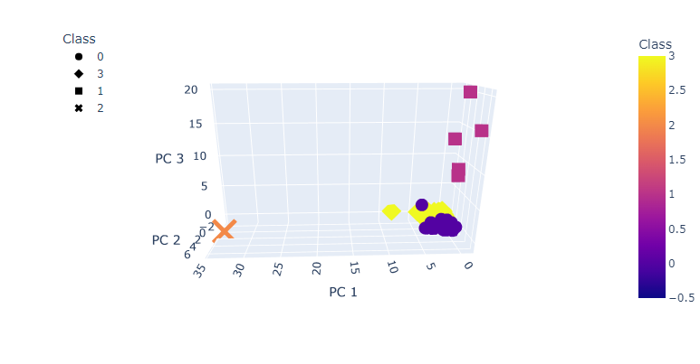

# Cryptocurrencies

**File Sources:** [crypto_data.csv](resources/crypto_data.csv)

---

## Challenge Overview:

Accountability Accounting is an investment bank that is interested in offering new cryptocurrency investment portfolio to customers. In order to understand the cryptocurrency market better, they would like unsupervised learning performed. Process the data, clustering it, reduce the dimensions and reduce the principal components using PCA.

The data is not ideal, so it will need to be processed to fit the machine learning models. Create visualizations from the models so that Accountability Accounting can better understand cryptocurrencies.

---

## Results:

Data cleaning and PCA was performed on the original dataset to provide the following dataframe.

After finding the k-means and creating the predictive model through unsupervised learning, the following elbow-curve was created to confirm the best k-value and number of clusters.

The clustered data was then used to create a 3D scatter plot for visualization

The data was then scaled with the clustered dataframe into a new dataframe. The following hover scatterplot was then created to show the coins names, total coins mined, and total coin supply by their class.

